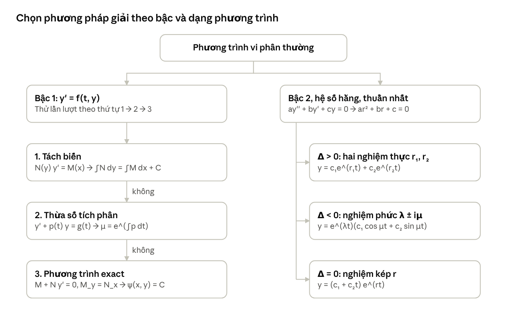

# Tổng hợp kiến thức Phương trình vi phân (Lecture 1–10)

Môn Differential Equations (微分方程) – Jerry Tai (戴立嘉), NYCU, Fall 2026. Cập nhật 2026-10-03.

## Tổng quan

10 lecture đầu chia làm hai khối. Lecture 2–7 giải phương trình bậc nhất bằng 3 kỹ thuật và ứng dụng vào mô hình. Lecture 8–10 giải phương trình tuyến tính thuần nhất bậc hai hệ số hằng theo 3 trường hợp nghiệm.

| Lecture | Chủ đề | Công cụ chính |
| --- | --- | --- |
| 1 | Giới thiệu môn học | Giáo trình Nagle–Saff–Snider, cách tính điểm |
| 2 | Định nghĩa, phân loại | ODE/PDE, bậc, tuyến tính |
| 3 | Trường hướng | Cân bằng, ổn định |
| 4 | Tách biến | Đảo quy tắc dây chuyền |
| 5 | Tuyến tính bậc nhất | Thừa số tích phân (đảo quy tắc đạo hàm tích) |
| 6 | Phương trình exact | Đảo đạo hàm ẩn, M_y = N_x |
| 7 | Mô hình hóa | Bể muối, lãi kép |
| 8 | Bậc 2, nghiệm thực phân biệt | Phương trình đặc trưng |
| 9 | Bậc 2, nghiệm phức | Công thức Euler |
| 10 | Bậc 2, nghiệm kép | Giảm bậc, Wronskian |

Công thức trên slide chủ yếu là ảnh, nên một số ví dụ trong file này do mình tự soạn và có ghi chú rõ. Các ví dụ có số liệu cụ thể trong slide (Lecture 3, 4, 5, 7) được giữ nguyên.

## Lecture 2 – Định nghĩa và phân loại

Phương trình vi phân (PTVP) là phương trình chứa đạo hàm của một hoặc nhiều hàm chưa biết. Phân loại đúng giúp chọn đúng công cụ giải.

**Ba cách phân loại:**

| Tiêu chí | Ý nghĩa | Ví dụ |
| --- | --- | --- |
| ODE hay PDE | ODE: một biến độc lập. PDE: nhiều biến độc lập (có đạo hàm riêng) | dy/dt = ky là ODE; phương trình nhiệt ∂T/∂t = k ∂²T/∂x² là PDE |
| Bậc (order) | Bậc của đạo hàm cao nhất | y'' + y = 0 là bậc 2; y⁽⁵⁾ + … là bậc 5 |
| Tuyến tính hay phi tuyến | Viết được dưới dạng bên dưới thì tuyến tính | y'' + t y' = sin t tuyến tính; y' = y² phi tuyến |

Phương trình tuyến tính bậc n có dạng:

```math
a_n(t)\,y^{(n)} + a_{n-1}(t)\,y^{(n-1)} + \dots + a_1(t)\,y' + a_0(t)\,y = g(t)
```

Cách kiểm tra nhanh tính tuyến tính:

- y và mọi đạo hàm của y chỉ xuất hiện ở bậc 1 (không có y², (y')², y·y').
- Không có hàm phi tuyến của y như sin y, eʸ, √y.
- Hệ số chỉ phụ thuộc biến độc lập t (được phép là t², sin t, eᵗ).

Cách gọi tên đầy đủ: ví dụ "phương trình vi phân thường bậc 2 tuyến tính" (2nd order linear ODE).

**Môn học tập trung vào** ODE tuyến tính bậc 1, bậc 2 và bậc n, vì có lời giải đẹp cho bậc 1–2 và có bộ giải số tốt cho bậc cao.

**Ví dụ mô phỏng: phương trình nhiệt 1D.** Chia bức tường thành các ô dài Δx. Cân bằng năng lượng của một ô cho:

```math
c_P m\,\Delta T = \kappa\,\frac{T(x+\Delta x) - 2T(x) + T(x-\Delta x)}{\Delta x}\,\Delta t \;\Rightarrow\; \frac{\partial T}{\partial t} = k\,\frac{\partial^2 T}{\partial x^2}, \quad k = \frac{\kappa}{\rho c_P}
```

Trong đó κ là hệ số dẫn nhiệt, ρ là khối lượng riêng, c_P là nhiệt dung riêng, k là hệ số khuếch tán nhiệt.

**Lecture 1** chỉ giới thiệu môn học: giáo trình Nagle, Saff, Snider (bản 9), điểm gồm Midterm I 25%, Midterm II 25%, Final 50%, không có homework.

## Lecture 3 – Trường hướng (Direction Fields)

Không cần giải phương trình vẫn biết được nghiệm hành xử thế nào: vẽ trường hướng, tìm điểm cân bằng và xét ổn định.

**Trường hướng.** Với y' = f(t, y), tại mỗi điểm (t, y) ta vẽ một mũi tên nhỏ có hệ số góc f(t, y). Đi theo các mũi tên từ điểm đầu ta được dáng của nghiệm (đường cong tích phân).

Ví dụ trong bài: y' = (1 − t) y. Tại t = 0.5, y = 2.1 thì y' = 1.05. Ước lượng bằng tiếp tuyến: y(1.5) ≈ 2.1 + 1.05 × 1 = 3.15. Đây chính là ý tưởng của phương pháp Euler:

```math
y(t + \Delta t) \approx y(t) + f(t, y)\,\Delta t
```

**Cân bằng và ổn định** (với phương trình tự trị y' = f(y)):

- Giá trị cân bằng: nghiệm của f(y) = 0. Nghiệm hằng y(t) = c tương ứng gọi là nghiệm cân bằng.
- Ổn định (stable): mũi tên hai bên đều hướng về đường cân bằng.
- Không ổn định (unstable): hai bên đều đi ra xa.
- Bán ổn định (semi-stable): một bên đi vào, một bên đi ra.

**Ví dụ mẫu (dạng bài thi hay gặp):** y' = (y² − y − 2)(1 − y)² = (y − 2)(y + 1)(1 − y)².

1. Cho y' = 0: cân bằng tại y = −1, 1, 2.
2. Xét dấu y' từng miền: y < −1 dương; −1 < y < 1 âm; 1 < y < 2 âm; y > 2 dương.
3. Kết luận: y = −1 ổn định, y = 1 bán ổn định, y = 2 không ổn định.

| Giá trị y(0) | Khi t → ∞ |
| --- | --- |
| y(0) < 1 | y → −1 |
| 1 ≤ y(0) < 2 | y → 1 |
| y(0) = 2 | y = 2 |
| y(0) > 2 | y → ∞ |

Bài cũng có phần thực hành con lắc tắt dần trên myphysicslab: tăng lực cản (damping) thì biên độ giảm nhanh hơn, còn tăng khối lượng thì giảm chậm hơn. Slide không trình bày định lý tồn tại và duy nhất nghiệm.

## Lecture 4 – Tách biến (Separation of Variables)

Nếu đưa được phương trình về dạng N(y) dy/dx = M(x) thì tích phân hai vế là xong. Đây là quy tắc dây chuyền đảo ngược, áp dụng cho cả phương trình tuyến tính lẫn phi tuyến.

**Giải ODE là gì:** khử hết đạo hàm. Kết quả có thể ở dạng tường minh y = f(x) hoặc ẩn F(x, y) = C.

```math
N(y)\,\frac{dy}{dx} = M(x) \;\Rightarrow\; \int N(y)\,dy = \int M(x)\,dx + C
```

**Quy trình:**

1. Biến đổi về dạng N(y) y' = M(x) ("nhân chéo": đưa hết y và dy sang một bên, x và dx sang bên kia).
2. Tích phân hai vế, chỉ cần một hằng số C.
3. Nếu được thì giải ra y (nghiệm tường minh). Nếu có điều kiện đầu thì thay vào để tìm C (nghiệm riêng).

**Ví dụ trong bài:** dy/dx = −x/y.

```math
y\,dy = -x\,dx \;\Rightarrow\; \frac{y^2}{2} = -\frac{x^2}{2} + C \;\Rightarrow\; x^2 + y^2 = 2C
```

Mỗi giá trị C cho một đường tròn. Họ các đường cong nghiệm theo C gọi là **đường cong tích phân** (integral curves). Muốn biết một điểm có nằm trên nghiệm đi qua (x₀, y₀) hay không, chỉ cần kiểm tra x² + y² = x₀² + y₀². Ví dụ nghiệm qua (2, 0) là x² + y² = 4, nên điểm (1.2, 1.6) nằm trên đó.

**Cần nhớ:** khi chia cho hàm của y (ví dụ chia cho y), có thể làm mất nghiệm hằng y = 0. Nên kiểm tra riêng các nghiệm cân bằng này.

## Lecture 5 – Phương trình tuyến tính bậc nhất, thừa số tích phân

Mọi phương trình y' + p(t) y = g(t) đều giải được bằng thừa số tích phân μ(t). Đây là quy tắc đạo hàm tích đảo ngược.

Dạng tổng quát a₁(t) y' + a₀(t) y = b(t). Chia cho a₁(t) để đưa về dạng chuẩn:

```math
y' + p(t)\,y = g(t), \qquad \mu(t) = e^{\int p(t)\,dt}
```

**Vì sao μ hoạt động:** μ' = pμ, nên μy' + pμy = (μy)'. Vế trái trở thành đạo hàm của một tích.

**Quy trình 4 bước:**

1. Đưa về dạng chuẩn (hệ số của y' bằng 1) và tính μ = e^(∫p dt). Không cần hằng số khi tính ∫p.
2. Nhân cả hai vế với μ.
3. Viết lại vế trái thành (μy)'.
4. Tích phân hai vế rồi chia cho μ.

```math
y(t) = \frac{1}{\mu(t)}\left[\int \mu(t)\,g(t)\,dt + C\right]
```

**Ví dụ trong bài:** y' + 3t² y = 5t².

```math
\mu = e^{t^3}, \quad (e^{t^3} y)' = 5t^2 e^{t^3} \;\Rightarrow\; e^{t^3} y = \tfrac{5}{3} e^{t^3} + C \;\Rightarrow\; y = \tfrac{5}{3} + C e^{-t^3}
```

**Hành vi dài hạn:** lấy giới hạn khi t → ∞. Ở ví dụ trên, Ce^(−t³) → 0 với mọi C, nên mọi nghiệm hội tụ về y = 5/3. Do đó nghiệm cân bằng y = 5/3 ổn định.

Phương trình này cũng tách biến được, nhưng nhiều phương trình tuyến tính khác (ví dụ y' + y = t) thì không. Khi đó thừa số tích phân là cách duy nhất, và thường phải dùng tích phân từng phần.

## Lecture 6 – Phương trình toàn phần (Exact Equations)

Phương trình M(x, y) + N(x, y) y' = 0 là exact khi M_y = N_x. Khi đó nghiệm là ψ(x, y) = C. Đây là công cụ cho phương trình phi tuyến và không tách biến được.

**Ý tưởng (đạo hàm ẩn đảo ngược):** nếu y = y(x) thì

```math
\frac{d}{dx}\,\psi(x, y(x)) = \psi_x + \psi_y\,\frac{dy}{dx}
```

Vậy nếu tìm được ψ với ψ_x = M và ψ_y = N thì phương trình trở thành dψ/dx = 0, tức ψ(x, y) = C.

**Điều kiện exact:** vì ψ_xy = ψ_yx (thứ tự đạo hàm riêng không quan trọng), ψ chỉ tồn tại khi

```math
\frac{\partial M}{\partial y} = \frac{\partial N}{\partial x}
```

Nếu điều kiện sai thì không tồn tại ψ, có cố bao lâu cũng không tìm ra.

**Quy trình tìm ψ:**

1. Xác định M (hệ số đứng tự do, hay đi với dx) và N (hệ số của y', hay đi với dy). Kiểm tra M_y = N_x.
2. Tích phân theo x: ψ = ∫M dx + h(y).
3. Đạo hàm theo y và cho bằng N để tìm h'(y), rồi tích phân ra h(y).
4. Viết nghiệm ẩn ψ(x, y) = C. Có điều kiện đầu thì thay vào tìm C.

**Ví dụ (tự soạn để minh họa):** (2xy + 3x²) + (x² + 2y) y' = 0.

- M_y = 2x và N_x = 2x, nên phương trình exact.
- ψ = ∫(2xy + 3x²) dx = x²y + x³ + h(y).
- ψ_y = x² + h'(y) = x² + 2y, suy ra h(y) = y².
- Nghiệm: x²y + x³ + y² = C.

**Bảng chọn phương pháp cho phương trình bậc nhất** (tổng kết trong bài):

| Loại phương trình | Điều kiện | Phương pháp |
| --- | --- | --- |
| Tách biến (tuyến tính hoặc không) | N(y) y' = M(x) | Tách biến |
| Tuyến tính | y' + p(t) y = g(t) | Thừa số tích phân |
| Phi tuyến, không tách biến | M + N y' = 0 với M_y = N_x | Phương trình exact |

## Lecture 7 – Mô hình hóa bằng phương trình bậc nhất

Mô hình hóa gồm 3 bước: dịch bài toán thực tế thành PTVP, giải hoặc phân tích định tính, rồi so với thực nghiệm. Hai ví dụ trong bài đều là phương trình tuyến tính, giải bằng thừa số tích phân.

### Ví dụ 1: Bể nước muối

Bể chứa 100 gal nước và Q₀ lb muối. Nước có nồng độ 1/4 lb/gal chảy vào với tốc độ r gal/min, và chảy ra cùng tốc độ.

**Nguyên tắc:** tốc độ thay đổi = lượng vào − lượng ra (mỗi lượng = nồng độ × lưu lượng).

```math
\frac{dQ}{dt} = \frac{r}{4} - \frac{r\,Q}{100}, \quad Q(0) = Q_0 \;\Rightarrow\; Q(t) = 25 + (Q_0 - 25)\,e^{-rt/100}
```

- Giới hạn: Q_L = 25 lb, vì cuối cùng bể chứa toàn nước 0.25 lb/gal × 100 gal.
- r = 3, Q₀ = 2Q_L = 50: cần Q ≤ 25.5 lb (sai lệch 2%), tức 25e^(−3T/100) = 0.5, suy ra T = (100 ln 50)/3 ≈ 130.4 phút.
- Muốn T ≤ 45 phút: r = (100 ln 50)/45 ≈ 8.69 gal/min.

Mô hình dạng này còn dùng cho ô nhiễm hồ nước và nồng độ thuốc trong cơ thể. Nếu lưu lượng vào và ra khác nhau thì thể tích thay đổi theo t, phải đưa vào phương trình.

### Ví dụ 2: Lãi kép liên tục

Lãi suất năm r, gửi thêm (k > 0) hoặc rút ra (k < 0) đều đặn với tốc độ k mỗi năm:

```math
\frac{dS}{dt} = rS + k \;\Rightarrow\; S(t) = S_0 e^{rt} + \frac{k}{r}\left(e^{rt} - 1\right)
```

- Không gửi thêm (k = 0) thì S = S₀e^(rt). Lãi kép m lần/năm cho S₀(1 + r/m)^(mt), tiến tới S₀e^(rt) khi m → ∞.
- Ví dụ IRA: mở lúc 25 tuổi, mỗi năm gửi $2000, r = 8%. Đến 65 tuổi: S(40) = 25000(e^3.2 − 1) ≈ $588,000.

## Lecture 8 – Phương trình bậc hai: phương trình đặc trưng, nghiệm thực phân biệt

Phương trình ay'' + by' + cy = 0 (hệ số hằng, thuần nhất) giải bằng cách thử y = e^(rt), đưa về phương trình bậc hai theo r.

Bậc cao khó hơn bậc nhất rất nhiều, nên bài đơn giản hóa dần:

```math
P(t)y'' + Q(t)y' + R(t)y = G(t) \;\to\; G = 0 \text{ (thuần nhất)} \;\to\; ay'' + by' + cy = 0 \text{ (hệ số hằng)}
```

Luôn có sẵn nghiệm cân bằng y = 0.

**Phương trình đặc trưng.** Thay y = e^(rt) vào ta được e^(rt)(ar² + br + c) = 0. Vì e^(rt) không bao giờ bằng 0, phải có:

```math
ar^2 + br + c = 0, \qquad r_{1,2} = \frac{-b \pm \sqrt{b^2 - 4ac}}{2a}
```

Có 3 trường hợp theo Δ = b² − 4ac: hai nghiệm thực phân biệt (bài này), nghiệm phức (Lecture 9), nghiệm kép (Lecture 10).

**Δ > 0, nghiệm thực phân biệt r₁ ≠ r₂:**

```math
y(t) = c_1 e^{r_1 t} + c_2 e^{r_2 t}
```

**Điều kiện đầu.** Phương trình bậc N cần N điều kiện đầu. Với bậc 2, cho y(t₀) và y'(t₀), thay vào y và y' rồi giải hệ 2 ẩn c₁, c₂.

**Ví dụ (tự soạn để minh họa):** y'' + 5y' + 6y = 0, y(0) = 2, y'(0) = 3.

1. Phương trình đặc trưng r² + 5r + 6 = 0, nên r = −2 hoặc r = −3.
2. Nghiệm tổng quát y = c₁e^(−2t) + c₂e^(−3t).
3. Thay điều kiện đầu: c₁ + c₂ = 2 và −2c₁ − 3c₂ = 3, suy ra c₁ = 9, c₂ = −7.
4. Nghiệm riêng y = 9e^(−2t) − 7e^(−3t).

Lecture 8 cũng ôn lại bài toán bể muối qua các demo tương tác. Wronskian xuất hiện ở Lecture 10.

## Lecture 9 – Nghiệm phức của phương trình đặc trưng

Khi Δ = b² − 4ac < 0, phương trình đặc trưng có cặp nghiệm phức liên hợp r = λ ± iμ. Nghiệm thực là e^(λt) nhân với cos và sin của μt.

```math
r = \lambda \pm i\mu, \qquad \lambda = -\frac{b}{2a}, \quad \mu = \frac{\sqrt{4ac - b^2}}{2a}
```

**Công thức Euler** giúp bỏ phần ảo:

```math
e^{i\theta} = \cos\theta + i\sin\theta \;\Rightarrow\; e^{(\lambda + i\mu)t} = e^{\lambda t}(\cos\mu t + i\sin\mu t)
```

Nghiệm phức có dạng c₁e^(λt)(cos μt + i sin μt) + c₂e^(λt)(cos μt − i sin μt). Có hai cách giải thích vì sao vẫn thu được nghiệm thực:

- Cách 1: gom lại thành (c₁ + c₂) và i(c₁ − c₂). Hai hằng số mới này luôn thực khi điều kiện đầu thực.
- Cách 2: phần thực e^(λt)cos μt và phần ảo e^(λt)sin μt, mỗi cái riêng đều là nghiệm. Chúng tạo thành hệ nghiệm cơ bản (fundamental set of solutions).

**Nghiệm tổng quát:**

```math
y(t) = e^{\lambda t}\left(c_1 \cos \mu t + c_2 \sin \mu t\right)
```

**Ví dụ (tự soạn để minh họa):** y'' + 2y' + 5y = 0, y(0) = 1, y'(0) = 1.

1. r² + 2r + 5 = 0 cho r = −1 ± 2i, tức λ = −1, μ = 2.
2. y = e^(−t)(c₁ cos 2t + c₂ sin 2t).
3. y(0) = c₁ = 1. Tiếp theo y'(0) = −c₁ + 2c₂ = 1, nên c₂ = 1.
4. y = e^(−t)(cos 2t + sin 2t), dao động tắt dần vì λ < 0.

**Ý nghĩa vật lý:** λ < 0 cho dao động tắt dần, λ = 0 cho dao động điều hòa, λ > 0 cho dao động tăng dần. μ là tần số góc.

## Lecture 10 – Nghiệm kép và phương pháp giảm bậc

Khi Δ = 0, phương trình đặc trưng có nghiệm kép r = −b/(2a). Nghiệm thứ hai là t e^(rt), tìm được bằng phương pháp giảm bậc.

**Giảm bậc (Reduction of Order).** Biết một nghiệm y₁ của phương trình tuyến tính thuần nhất bậc 2, ta đoán nghiệm thứ hai có dạng y₂ = v(t) y₁(t).

1. Thay y₂ = v y₁ vào phương trình. Các số hạng chứa v tự triệt tiêu vì y₁ là nghiệm, chỉ còn v'' và v'.
2. Đặt w = v'. Phương trình trở thành tuyến tính bậc nhất theo w, giải bằng tách biến hoặc thừa số tích phân.
3. Tích phân w để có v, rồi y₂ = v y₁. Có thể chọn các hằng số đơn giản nhất.

**Áp dụng cho nghiệm kép.** Với y₁ = e^(rt) và r = −b/(2a), thay vào ta được a v'' e^(rt) = 0, tức v'' = 0. Do đó v = t (bỏ hằng số) và y₂ = t e^(rt).

```math
y(t) = c_1 e^{rt} + c_2\, t\, e^{rt}
```

**Wronskian** kiểm tra hai nghiệm có tạo thành hệ nghiệm cơ bản hay không (W ≠ 0 thì được):

```math
W(y_1, y_2) = y_1 y_2' - y_1' y_2, \qquad W(e^{rt}, t e^{rt}) = e^{2rt} \neq 0
```

**Ví dụ (tự soạn để minh họa):** y'' + 4y' + 4y = 0, y(0) = 1, y'(0) = 3.

1. r² + 4r + 4 = (r + 2)² = 0, nghiệm kép r = −2.
2. y = (c₁ + c₂t) e^(−2t).
3. y(0) = c₁ = 1. Tiếp theo y'(0) = −2c₁ + c₂ = 3, nên c₂ = 5.
4. y = (1 + 5t) e^(−2t).

Giảm bậc không chỉ dùng cho hệ số hằng. Nó áp dụng cho mọi phương trình tuyến tính thuần nhất bậc 2 khi đã biết một nghiệm.

## Tóm tắt công thức và cách chọn phương pháp

Với phương trình bậc 1, thử lần lượt tách biến, tuyến tính, rồi exact. Với bậc 2 hệ số hằng, dấu của Δ quyết định dạng nghiệm.



Một phương trình có thể thuộc nhiều dạng cùng lúc, ví dụ y' + 3t²y = 5t² vừa tách biến vừa tuyến tính. Khi đó chọn cách nào tính nhanh hơn.

| Cần nhớ | Công thức |
| --- | --- |
| Thừa số tích phân | μ = e^(∫p dt), y = (1/μ)[∫μg dt + C] |
| Điều kiện exact | M_y = N_x; ψ = ∫M dx + h(y), ψ_y = N |
| Cân bằng (y' = f(y)) | f(y\*) = 0; mũi tên hướng vào thì ổn định |
| Bể muối | Q' = (nồng độ vào)(lưu lượng vào) − (Q/V)(lưu lượng ra) |
| Lãi kép liên tục | S' = rS + k, S = S₀e^(rt) + (k/r)(e^(rt) − 1) |
| Công thức Euler | e^(iθ) = cos θ + i sin θ |
| Giảm bậc | y₂ = v(t) y₁, đặt w = v' để được phương trình bậc 1 |
| Wronskian | W = y₁y₂' − y₁'y₂ ≠ 0 thì y₁, y₂ là hệ nghiệm cơ bản |
| Số điều kiện đầu | Phương trình bậc N cần N điều kiện |
